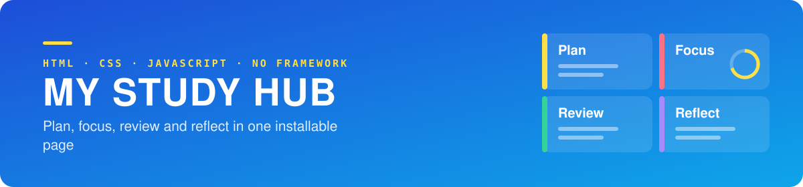
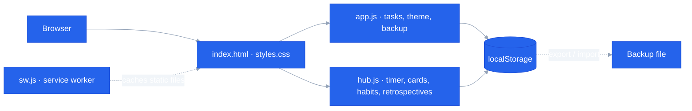

<div align="center">




Personal project · March 2026

[Why](#why) · [What it does](#what-it-does) · [Design](#design) · [My role](#my-role) · [Limitations](#limitations-and-next-steps)

</div>

---

> **Where it stands — working app**  
> The app installs to the home screen and opens offline.  
> Data stays in one browser; there is no sync between devices yet.

| | |
|---|---|
| Period | March 2026 |
| Team | Individual |
| Stack | HTML, CSS, JavaScript (no framework), Service Worker, localStorage, Netlify |

## Why

My study day was spread across a to-do app, a pomodoro timer, a flashcard app and a notes file. Switching between them cost attention, and none of them knew about the others. My Study Hub puts the whole loop in one place.

| Plan | Focus | Review | Reflect |
| :--- | :--- | :--- | :--- |
| Tasks with priority, tags and deadlines | Pomodoro timer | Flashcards and review | Habits, milestones and retrospectives |

## What it does

| Area | Features |
| :--- | :--- |
| **Tasks** | Priority, tags, due date and time, search, sort, filter, edit |
| **Focus** | Pomodoro with adjustable focus length and timer modes |
| **Study cards · Review** | Flashcards and review |
| **Motivation · Habits** | Habit tracking and completion milestones |
| **Feedback · Retrospective** | Retrospective notes |
| **Summary** | Today's summary and statistics |
| **Settings** | Light and dark themes, background tint, full data backup and restore |

The interface is in Korean.

## Design

There is no build step and no server. The page is static files, a service worker caches them, and all data lives in the browser.



## My role

Individual project: planning, interface design, implementation and deployment configuration.

## What I learned

- Keeping state and screen in sync without a framework (`js/app.js`, `js/hub.js`).
- Caching static files with a service worker so the app opens offline.
- Making a page installable with a web app manifest.
- Backing up and restoring `localStorage` data, and managing its keys.
- Accessibility basics: `aria-label` on the main controls.
- Security and cache headers on Netlify (`netlify.toml`).

## Resources used

- MDN Web Docs: Service Worker, Web App Manifest, Web Storage
- Netlify documentation

## Results

| Build step | npm packages | Install | Offline |
| :---: | :---: | :---: | :---: |
| **None** | **0** | **Home screen** | **Supported** |

`index.html` deploys as it is.

## Limitations and next steps

| Limitation | Next step |
| :--- | :--- |
| Data lives in one browser's `localStorage` | Sync between devices; today it moves by backup file |
| No automated tests | Unit tests for task and timer logic |
| `hub.js` is over 1,100 lines | Split into modules by feature |

## Run it

```bash
python3 -m http.server 8000
```

Open `http://localhost:8000`. The service worker only runs on `localhost` or HTTPS.
